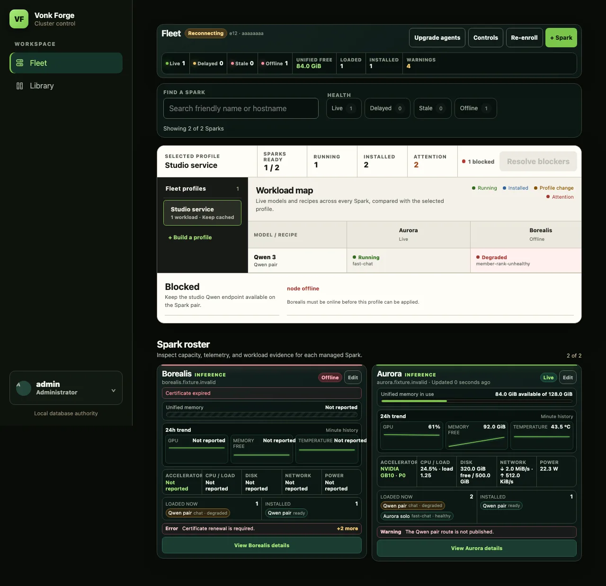
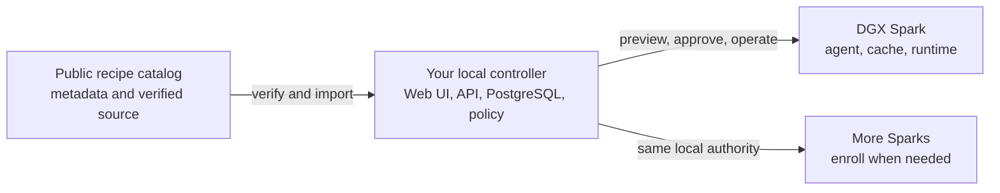

# Vonk Forge

**Local AI. One private control plane.**

Vonk Forge is an open-source control plane for NVIDIA DGX Spark. Run the
controller on any local computer with Docker Compose—including your laptop—then
use one private Web interface or the `vonkctl` CLI to discover model recipes,
preview changes, and operate one Spark or a fleet.

[Install Vonk Forge](https://vonkforge.ai/install) ·
[See how it works](https://vonkforge.ai/architecture) ·
[Browse recipes](https://vonkforge.ai/recipes) ·
[Read the operator docs](docs/README.md)



> The screenshot is produced by the repository's fixture-backed browser
> acceptance suite. It contains no live fleet data.

## What it gives you

- **One place to operate local AI.** Fleet, Library, Activity, and reusable
  fleet profiles share one controller and one source of truth.
- **A safer change path.** See compatibility, placement, downloads, memory,
  and the exact planned change before you apply it.
- **Reproducible model recipes.** Recipes bind model, runtime, topology,
  capacity, source, and qualification facts to immutable identities.
- **No routine Spark SSH.** A native Rust agent connects outbound and executes
  controller-authorized work after enrollment.
- **Your infrastructure stays authoritative.** The controller, PostgreSQL
  state, identity, secrets, model caches, and fleet state remain local.

## The 30-second mental model



The public website is documentation and catalog—not a hosted admin surface.
Model artifacts remain at immutable origins and in node-local caches. Your
controller decides what may run and records what happened.

## Install

### 1. Prepare the controller project

Before the first run, complete the mandatory
[Tailscale preflight](docs/runbooks/tailscale.md#fresh-install-preflight): enable
MagicDNS and HTTPS, define the exact unsuffixed Services, apply the reviewed
grants and auto-approvals, and create the scoped gateway OAuth client. Never
add test-only Service names or policy to an operator tailnet.

Then, on macOS or Linux, run:

```bash
curl -fsSL https://install.vonkforge.ai/nas | sh
```

The signed interactive installer creates one portable, private project:

```text
vonk-forge/
├── docker-compose.yaml
├── .env
└── secrets/
```

The `/nas` path in the public installer URL is historical; the generated
project is not NAS-specific. Keep it on this laptop for a lab, or move the
complete directory to a NAS or local server for an always-on controller.

### 2. Start it on your chosen Docker Compose host

With a shell on that host:

```bash
cd vonk-forge
docker compose pull
docker compose up -d --wait --remove-orphans
docker compose ps
```

In a NAS or server UI, select the same directory as one Compose project and
start `docker-compose.yaml`. Keep `.env` and `secrets/` beside it.

### 3. Add a Spark

Open the controller's private Web address, go to **Fleet**, and create a one-use
enrollment grant. Run the generated command on the Spark. It has this shape:

```bash
curl -fsSL https://install.vonkforge.ai/spark | VONK_CONTROLLER_ADDRESS=192.168.1.231 sh
```

Use the stable LAN address of your laptop, NAS, or server. The installer verifies
the immutable release, enrolls the native agent, writes the required agent and
firewall configuration, and checks service health. Repeat with a new one-use
grant for each additional Spark.

The same controller command prepares upgrades while preserving local identity
and secrets. Running the Spark installer on an enrolled node performs an in-place
agent upgrade; certificate replacement is an explicit Fleet re-enrollment.

## Daily operation

| Stage | What you see before moving on |
| --- | --- |
| Find | Local and public recipes filtered against the fleet you actually own |
| Preview | Compatibility, placement, capacity, downloads, and planned changes |
| Apply | One digest-bound plan, confirmed in the browser or with an explicit CLI flag |
| Observe | Live Fleet state, workload progress, warnings, recovery, and audit history |

The private Web Controller is the guided path. `vonkctl` exposes the same API,
filters, previews, mutations, and JSON output for repeatable operations. See the
[complete CLI guide](docs/runbooks/vonkctl.md).

## Security boundary

| Public | Local controller | DGX Sparks |
| --- | --- | --- |
| Documentation, signed installers, recipe metadata, verified source | PostgreSQL authority, policy, service identity, runtime secrets, previews | Enrolled agent identity, model caches, runtime execution, telemetry |

- The public site never controls Sparks or receives runtime secrets, fleet
  state, controller authority, or model uploads.
- Agents connect outbound with independently enrolled identity.
- Secret values live in controller-owned files, not Git, command arguments, or
  captured diagnostics.
- Model weights are fetched from immutable origins and cached on the Sparks;
  they do not pass through the public catalog.

For the trust and network model, see the
[architecture guide](https://vonkforge.ai/architecture) and
[threat model](docs/security/threat-model.md).

## Repository map

| Area | Purpose |
| --- | --- |
| `control/` | FastAPI controller, PostgreSQL authority, migrations, and Web Controller |
| `agent/` | Native Rust Spark agent and local enforcement |
| `deploy/` | Signed controller/Spark installation and Compose contract |
| `scripts/` | Validation, import, publication, and operator tooling |
| `docs/` | Architecture, security, runbooks, and contributor policy |

The public recipe standard library lives in
[`CarstVaartjes/vonk-forge-recipes`](https://github.com/CarstVaartjes/vonk-forge-recipes).
The public website and catalog implementation live in
[`CarstVaartjes/vonk-forge-web`](https://github.com/CarstVaartjes/vonk-forge-web).

## Develop

Required tools are Python 3.12+, [`uv`](https://docs.astral.sh/uv/), Rust,
Node.js, and Docker for integration tests.

```bash
uv sync --dev
uv run --frozen pytest -q
uv run --project control --frozen --with-editable . pytest -q control/tests
npm ci --prefix control/web
npm test --prefix control/web -- --run
uv run --frozen pytest -q deploy/compose/tests
scripts/verify-supply-chain --json
```

Start with the [documentation index](docs/README.md),
[Compose deployment notes](deploy/compose/README.md), and
[testing policy](docs/testing-and-ci.md).

## License

Vonk Forge is available under the [MIT License](LICENSE).
