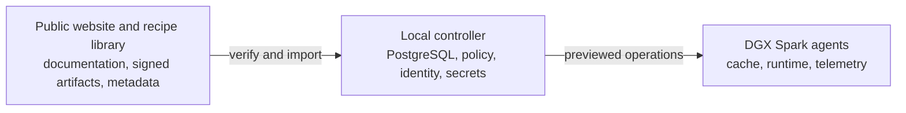

# Vonk Forge documentation

Vonk Forge is a private control plane for one NVIDIA DGX Spark or a fleet. The
controller runs on any local computer with Docker Compose—your laptop, a NAS, or
a server—and owns the Web UI, API, PostgreSQL state, identity, policy, and
runtime secrets. Native Spark agents connect outbound; normal operation does not
require routine SSH.

## Choose your path

| I want to… | Start here |
| --- | --- |
| Install a controller and first Spark | [Public installation guide](https://vonkforge.ai/install) |
| Understand what is public and what stays local | [Architecture overview](architecture-overview.md) |
| Operate Fleet, Library, profiles, and workloads | [Control-plane operations](runbooks/control-plane-operations.md) |
| Use the complete terminal interface | [`vonkctl` guide](runbooks/vonkctl.md) |
| Deploy or upgrade the Docker Compose project | [Controller-host deployment](../deploy/compose/README.md) |
| Configure Tailscale before first install | [Tailscale fresh-install preflight](runbooks/tailscale.md#fresh-install-preflight) |
| Understand identities and trust | [Security threat model](security/threat-model.md) |
| Contribute or verify changes | [Testing and CI](testing-and-ci.md) |

## Authority at a glance

- Local PostgreSQL owns recipes, installations, placements, runs, profiles, and
  audit state. It remains usable without a hosted catalog or Git remote.
- The public recipe library contains immutable metadata and deterministic source
  contexts—not images, weights, credentials, or fleet state.
- Caddy is the private local ingress. Tailscale is the default remote-access
  boundary. Spark agents use enrolled identity and outbound connections.
- Recipe containers and model weights run and remain on Spark-local infrastructure,
  not on `vonkforge.ai` or Cloudflare Pages.

## Operator guides

- [Fresh development installation](runbooks/fresh-development-install.md)
- [Controller bootstrap](runbooks/control-plane-bootstrap.md)
- [Tailscale ingress and fresh-install preflight](runbooks/tailscale.md)
- [Controller operations](runbooks/control-plane-operations.md)
- [`vonkctl` controller CLI](runbooks/vonkctl.md)
- [Fleet recipe qualification](runbooks/fleet-recipe-qualification.md)
- [PostgreSQL authority administration](runbooks/authority-administration.md)
- [Node onboarding and health](runbooks/node-onboarding.md)
- [Agent installation and enrollment](operations/install-vonk-agent.md)
- [Telemetry and troubleshooting](runbooks/control-plane-telemetry.md)
- [Recipe and model switching](runbooks/model-switching.md)
- [Model and recipe identities](operators/model-catalog.md)
- [Standard recipe library](operators/recipe-library.md)
- [Execution harnesses](operators/execution-harnesses.md)

## Release and platform guides

- [Platform release publication](runbooks/platform-release-publication.md)
- [Agent package release](operations/agent-package-release.md)
- [Identity verification policy](identity-verifier.md)
- [DGX Spark platform-alignment audit](audits/2026-08-12-dgx-spark-platform-alignment.md)

Commands in these pages are plan-first: they expose revisions, placement,
resource checks, and affected nodes before mutation. State-changing CLI
operations require `--apply`. Credentials and private keys never belong in Git,
recipes, command arguments, or captured diagnostics.
