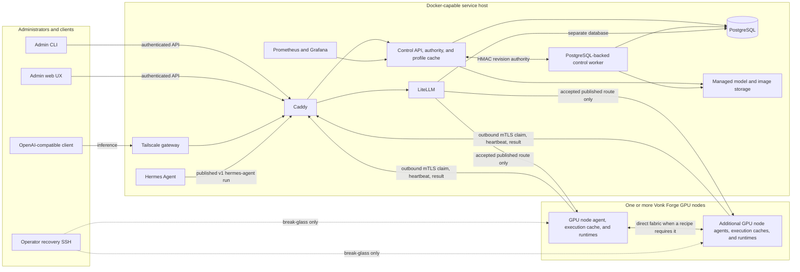
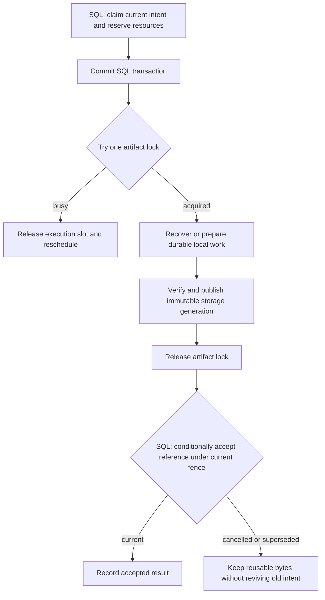

# Vonk Forge architecture overview

Vonk Forge separates the Docker service host from the GPU node compute plane. The
service host can be a NAS or any Docker Compose-capable Linux machine. Its local
model and recipe-image cache is the trusted authority for Fleet profile choices
and apply admission; Spark-local copies are execution caches only. A cluster
can contain one, two, or more Vonk Forge GPU nodes; no product contract fixes the count or
uses a GPU node hostname or IP address as identity.

This page describes the running architecture and its approved storage direction.
The [state ownership](#state-ownership) and [artifact recovery](#artifact-recovery)
sections define the target boundary. The
[implementation plan](plans/resilient-artifact-storage.md) records the remaining
work; this documentation does not claim that artifact bookkeeping has already
moved out of PostgreSQL.

Uninstall validates the requested installation's current typed metadata, recipe
identity, and artifact paths, then removes only that installation directory.
It does not scan unrelated installations or require the removed workload to
pass launch admission. Shared distribution objects and other installations'
materialized copies remain intact, including any hard links to the same bytes.
Invalid metadata or inaccessible storage within the requested installation
still rejects removal.

Each GPU node is independently installed and enrolled. Its stable `spk_…` identity
comes from the node key and certificate, while its current management address is
fresh authenticated presence evidence. DHCP reservations are useful operationally
but are never control-plane authority. Local DNS is optional: operators may map
`<NAS_MANAGEMENT_IP>` to `<ENROLLMENT_HOSTNAME>`, `<CONTROLLER_HOSTNAME>`, and
`<REGISTRY_HOSTNAME>` in `/etc/hosts` on the NAS and GPU nodes without changing
the trust model.

## One control contract at every fleet size

There is no fixed fleet size. Every enrolled Spark has one stable `spk_…`
identity backed by its own key and certificate; an IP address is not identity.
The control/runtime contract stays the same as nodes are added:

| Shape | Runtime behavior | Client and control behavior |
| --- | --- | --- |
| **One Spark** | A single-node runtime owns its model endpoint and all local artifacts. No fabric fields are required. | The agent calls `agents.vonk-forge.lan:8443`; after health evidence, the controller publishes one accepted route. |
| **Two Sparks** | A tensor-parallel gang assigns an entrypoint rank and a worker rank on the direct fabric. Only the entrypoint serves the model API. | Both certificate-bound ranks must acknowledge the same run before `mia-deepseek-v4-flash` is published. One stale or failed rank withdraws the whole route. |
| **Many Sparks** | The planner places independent workloads and gangs across compatible nodes. A gang can use any accepted subset; other nodes remain available for other work. | Each node still pulls only its fenced operations. The controller publishes each healthy entrypoint independently; it does not broadcast Docker commands or turn IP addresses into authority. |

For every shape, user inference follows **Tailscale → Caddy → LiteLLM → one
accepted recipe entrypoint**. Caddy knows paths, LiteLLM knows controller-published
aliases, and neither discovers containers. GPU nodes initiate outbound mTLS to
the NAS; they do not run Tailscale, Caddy, LiteLLM, PostgreSQL, or the control
API.

## State ownership

Each fact has one authoritative owner. The following is the target contract:

| Fact | Owner | Other representations |
| --- | --- | --- |
| Users, sessions, enrollment, certificates, revocations, and execution authorization | PostgreSQL | Files cannot grant or restore this authority. |
| Accepted catalog revisions, topology, saved profiles, desired placements, and exact plan references | PostgreSQL | Imported catalog files are source material; a digest reference does not assert local availability. |
| Operation intent, idempotency keys, queue/attempt ownership, cancellation, reservations, and route decisions | PostgreSQL | Local work records carry the owning request/attempt identity; they do not schedule or authorize work. |
| Model bytes, image archives, complete artifact manifests, and verification receipts | Managed artifact storage | A disposable index may accelerate discovery; readiness resolves through the storage owner. |
| Local download ranges, completed members, build/export checkpoints, and local failure diagnostics | Canonical typed records alongside the work | API progress is derived from these records and current worker evidence, without a second independently writable SQL checkpoint. |
| Audit history and retained Controller telemetry | PostgreSQL | Logs and metrics are observations, with their own retention rules. |
| Spark-local files, runtime observations, and agent result journal | Spark execution storage and authenticated evidence | They prove target effects; they cannot become NAS profile or permission authority. |
| LiteLLM application state | Its separate database in the PostgreSQL service | Controller-published route bundles remain derived from accepted run decisions. |

PostgreSQL provides atomic control-state changes, row locking, unique claims,
and queries shared by the API and worker. Keep these guarantees rather than
implementing a second scheduler or cross-record transaction engine in files.
Its use does not require every local byte counter or cache receipt to live in
SQL. Replacing PostgreSQL or LiteLLM's database is outside this direction.

### Current implementation

Today, `ModelCacheSet` and `ModelCacheSetArtifact` retain the logical
artifact-set identity and membership in SQL, while every model object's bytes,
size, and verification receipt are owned by managed storage under the cache
root. `ModelCacheOperation` retains the operation record and its checkpoints.
Image preparation writes managed filesystem receipts. SQL
`RuntimeImageAuthorization` records current recipe authorization for the exact
archive; the former SQL `RuntimeImageReceipt` table has been removed. Admission
requires both current authorization and the managed receipt with present bytes.
`RecipeBuild`, `Job`, and agent-operation rows retain request and output
identities, coordination, and reported results; they do not independently prove
that an archive is available.

Recent cache-recovery work already reconciles absent bytes after a NAS restore,
reuses completed transfers, and rebuilds missing source images. Preserve that
behavior. The [implementation plan](plans/resilient-artifact-storage.md) records
the completed model-availability and image-receipt changes and their repository
evidence. Deployed recovery and physical Spark acceptance remain separate
checks. Future ownership changes must update all consumers and retire the old
path together, while retaining control intent, exact selected identities,
authorization, reservations, and audit.

## Artifact recovery

Models and container images follow one recovery policy, with format-specific
transfer and build adapters. Native OCI stores keep their own blob/index
semantics; Controller JSON describes its managed archives and work, without
editing Docker or Podman internals. Shared policy does not require making a
source build behave like an HTTP range download.

- Bind work to exact model/recipe inputs, source revision, relevant builder
  identity, requested output, and its authorized request/attempt. Persist the
  identity before effects and checkpoints after the corresponding data is
  durable. Report measured bytes and phases; unknown progress stays unknown.
- Keep temporary work separate from complete immutable objects. Verify new
  content before publication. Write records through same-filesystem staging,
  sync data and required metadata, and atomically publish a complete generation.
  Multiple files require a commit protocol that survives death between writes;
  a JSON rename alone cannot make all artifact bytes durable.
- Reuse valid completed artifacts. Resume compatible partial downloads; repair
  or replace damaged temporary work within its managed scope. For builds,
  inspect retained results and restart only the unfinished safe work. Preserve
  reusable completed layers and final archives without weakening build isolation.
- An existing file or old failed attempt never permanently blocks a fresh
  authorized download or rebuild. A refresh preserves the last verified result.
  Repeating a request key follows that same request; an explicit new rebuild
  gets a new request identity. A new image digest is a new result and cannot
  silently replace an exact image in a bound plan or running workload.
- Serialize writers per artifact and fence superseded attempts. Inspect actual
  effects and live ownership after restart; recorded `running` or `completed`
  text is insufficient. Retry temporary failures automatically with bounded
  concurrency, backoff, and visible retry timing while intent remains current.
- Keep bad contracts, revoked authority, denied access, and integrity failures
  visible and fail closed. The affected object can be prepared again after its
  condition is corrected; unrelated work continues. Cancellation, explicit
  removal, and newer operator intent must survive delayed results and restarts.
- Admission trusts durable verification for immutable managed objects and
  checks presence, type, and length. Do not scan all model bytes on each read
  or restart. Publication, transfer, explicit verification, or evidence of
  corruption supplies the reason for content verification.

Garbage collection coordinates with current SQL references, reservations, and
active preparation. It may reclaim only objects proved unused under that
coordination. Database unavailability or a failed scan defers cleanup and leaves
an actionable reason. Slow progress observation must not stall transfer I/O.
Loss of coordination cannot authorize a new operation or let an expired attempt
publish; completed immutable data and durable partial work remain reusable.

A PostgreSQL backup restores control intent and permissions, not artifact bytes.
If storage is absent, expose missing assets and prepare them through the normal
authorized path. If artifact files survive but the database does not, preserve
the files and restore control authority before adoption or cleanup. Discovery
does not reconstruct users, grants, profiles, revocations, or catalog approval.
Optional artifact backups must include their manifests/checkpoints and use a
consistent storage snapshot or quiesced writers. See [backup recovery](postgres-backups.md).

## Coordination and deadlock prevention

The target must prevent circular waits across the database, filesystem, worker
pools, and parent/child operations. Each boundary below is mandatory for new
coordination code and an acceptance condition for the cutover. These are design
requirements; existing code still needs the audit and concurrent tests in the
implementation plan before conformance can be claimed.

### How the parts converge

The Controller persists accepted intent once. Each integration observes its
own effects and reconciles them toward that intent; no handoff assumes a SQL
commit, a file write, a remote effect, and an acknowledgement are atomic.

| Integration | Durable handoff and recovery boundary |
| --- | --- |
| Admin client to API | A retained request key identifies accepted intent; a lost response is recovered by querying that request. |
| API to worker | The worker claims current intent under a fenced lease, records waiting dependencies, and resumes unfinished steps after restart. |
| Worker to artifact storage | Exact input identity and durable local checkpoints allow reuse/resume; accepting the resulting reference is conditional on current intent. |
| Controller to Spark agent | Node-bound operations, attempt fences, heartbeats, and acknowledged result journals permit replay without assuming an effect ran exactly once. |
| Agent to runtime | Observe the exact installation/container/effect before retrying; uncertain arbitrary side effects require their own reconciliation contract. |
| Runtime evidence to route publication | Publish only the exact acknowledged, authorized generation; recover lost activation acknowledgements and withdraw stale serving authority. |
| Owners to UI/telemetry | Derived views can lag and show their observation time or unavailability; they cannot mutate ownership or block the work they observe. |
| References to cleanup/restore | Reconcile durable reservations and surviving storage before adoption or deletion; missing control authority cannot be reconstructed from bytes. |

Eventual consistency means observed progress, availability, execution, and
derived views catch up with accepted intent after recoverable faults clear.
It does not relax permissions, revocations, fencing, exact plan identity, or
route admission. Each boundary tolerates duplicate delivery, delayed results,
and temporary disconnection within those constraints. Recovery remains on the
normal operating path and scoped to the affected work.

### Ownership boundaries

| Boundary | Owns | Must never wait for |
| --- | --- | --- |
| API/admission transaction | Validate current authority; persist exact intent and reserve control resources atomically | Artifact locks, remote probes, filesystem scans, builds, transfers, or worker completion |
| Reconciler | Inspect current intent/effects; schedule the next eligible step; record bounded waiting state | A child while holding a transaction or an execution slot the child needs |
| Preparation/agent executor | One fenced attempt and its local effects/checkpoints | A parent-held node lease as a competing owner, or another job's execution slot while retaining its own |
| Artifact writer | One exact managed object's local write lock | Another artifact lock, a child operation, or a blocking database lock |
| Collector | A durable deletion reservation for an exact unreferenced object, then its local lock | Completion of a producer while holding a transaction or local lock |
| Observer/API projection | Read bounded state and report progress or an unavailable observation | Completion of the operation it is describing |

A reservation is durable ownership data, not permission to hold a database
transaction open. Parents may retain node ownership while children execute;
children inherit that owner and fence rather than acquiring conflicting leases.
If a new request supersedes the parent, cancellation/reconciliation resolves
issued effects before ownership passes to the replacement.

### Lock and transaction rules

1. **No SQL-to-filesystem lock edge.** Commit or roll back before acquiring a
   local artifact lock. Acquire that lock nonblockingly; if busy, release the
   execution slot and reschedule with a visible reason. Hold at most one
   artifact lock. Shared blobs use immutable publication and bounded conflict
   handling instead of a second nested artifact lock.
2. **One narrowly allowed reverse edge.** An artifact lock may contain a short
   SQL transaction to validate its fence/deletion reservation or renew its
   existing lease. This SQL path must be nonblocking, touch only its declared
   coordination rows, and
   never call preparation, admission, or orchestration recursively. Failure
   releases the artifact lock and defers work; it does not wait inside it.
3. **One SQL lock order.** Shared helpers acquire explicit row/advisory locks
   in a canonical order by lock namespace/table and immutable primary key.
   Multi-node targets are sorted by stable node ID. Declare the full lock set
   before acquisition; if new information requires an earlier lock, roll back
   and replan. Include implicit foreign-key, unique-index, and upsert locks in
   the audit; ordering explicit `FOR UPDATE` calls alone is insufficient.
4. **Bound every database wait.** Use `SKIP LOCKED` for eligible work claims
   and `NOWAIT` for contested coordination rows. Configure finite lock,
   statement, and transaction budgets centrally, including implicit lock waits.
   A conflict or PostgreSQL deadlock aborts the transaction; retry the complete
   transaction only after releasing its resources, with bounded backoff.
5. **Transactions contain database work only.** Never hold them across external
   HTTP, process execution, transfer/build/import, storage scans or hashing,
   child completion, or retry sleep. Read a bounded input snapshot, commit,
   perform the effect under its fence, then conditionally record the result in
   a fresh short transaction. Observers do not take mutation locks.

Publication has two separate commits. Storage first makes a verified immutable
generation durable. A subsequent conditional SQL update accepts its exact
reference only if the operation still owns its fence and current intent.
SQL owns that decision, not a second physical-availability flag. A crash between
these commits leaves reusable unassociated bytes; reconciliation can attach
them only under current authorization. Cancellation or removal racing the final
update wins through its fence. Late bytes never recreate a removed logical
entry or alter an already bound plan.

Ownership checks and lease renewals during preparation use only the bounded,
nonblocking SQL edge defined above. The diagram does not permit a transaction
to remain open between stages.

Deletion uses the corresponding reservation protocol: a short SQL transaction
proves the exact object unreferenced and reserves its deletion. New references
cannot be admitted while that reservation is active. The collector then takes
the artifact lock and validates the reservation nonblockingly before removing
that object. Interrupted deletion is reconciled before releasing the reservation;
lease expiry alone must not let a late collector delete newly referenced data.
Missing authority or storage evidence causes a bounded defer, never guessed
permission to delete.

### Scheduling and progress rules

- Dependency graphs must be acyclic. Validate parent/child edges before
  dispatch; do not let a child enqueue a dependency on an ancestor.
- Claim execution slots only for runnable effects. Waiting parents retain
  durable intent but release worker/build/transfer slots. A step cannot wait
  for another pool while holding a slot that the dependency needs. Acquire
  required scarce resources as one checked set or release partial acquisitions
  before deferring. Completed artifacts remain reusable across these retries.
- Check external readiness outside admission transactions, then revalidate
  the bounded evidence when committing the decision. Resource shortages create
  waiting work with a dependency and resume condition; they do not hold locks.
- Each wait records a reason, dependency identity, current owner where known,
  next check time, and persisted deadline. Heartbeats and restarts do not reset
  an effect's deadline. At expiry, reconcile, retry safely, or report an
  actionable failure. A temporary failure never permanently bans a fresh
  authorized request for that artifact.
- Leases and attempt fences protect every result and transition. Takeover
  checks exact process/runtime/storage effects; an expired heartbeat is not
  proof of death. Stale attempts cannot publish current references, renew
  authority, or revive cancelled/superseded work.
- Scan eligible work fairly. Skip a busy dependency and contain malformed or
  failed records to their own operation. One blocked source, artifact, profile,
  or expired attempt must not stop unrelated work or the reconciliation loop.

Required evidence includes a one-slot worker pool with a parent/child chain,
opposite-order requests for the same two nodes, concurrent prepare/remove,
database contention during artifact publication, expired-owner takeover, and
worker death at every commit boundary. Each case must prove bounded return,
preserved authority, and eventual progress after the injected fault clears.
Use real PostgreSQL and separate processes for database and OS-lock semantics;
use the Linux/OrbStack lane for process death and storage durability. These
checks establish conformance for the tested paths, not a blanket claim that
arbitrary future code can never deadlock.

## Trust and control flow

Vonk Forge has an explicit authority split. PostgreSQL is authoritative for the
local platform authority and recipe catalog: topology, fleet policy, package
families, authored and imported revisions, saved profiles, WorkloadRun import
reports, installations, placements, and runs. The trusted NAS/Controller cache
is the authoritative availability projection for profile authoring and apply
admission: profile choices resolve from it to exact model and recipe-image
identities. A published recipe catalog is optional discovery, never a remote
dependency for local execution, and a Spark-local copy never changes profile
authority. TUF remains the authority for signed platform release artifacts;
desired platform topology and policy are persisted in PostgreSQL.

For the current platform path, the API owns the PostgreSQL authority head,
immutable revisions, persisted proposals, and eligibility policy. The catalog
owns exact model versions, execution harnesses, recipe revisions,
installations, mappings, and runs. Recipe route publication derives LiteLLM
configuration from the accepted v1 run itself; no external repository or
Hermes fallback policy participates. Platform plans remain canonical and
persisted in PostgreSQL with their authority revision, targets, operation graph,
payload digests, routes, protocol range, and plan digest. Catalog plans use a
recipe revision digest as their own content identity.

The worker deliberately has no source checkout, Git credentials, Git/OpenSSH
executable, or GPU node-facing network. It advances durable reconciliations and
publishes atomic, leased route bundles. It obtains current-head and policy
decisions from the API over a dedicated two-party internal network. Those
bounded exchanges are nonce-bound, short-lived, HMAC authenticated, and never
exposed by Caddy.

Routine GPU node work is pull-based. Each GPU node agent opens an outbound mTLS request,
claims only operations for its certificate-bound node identity and compatible
protocol/capabilities, heartbeats a fenced attempt, and returns digest-bound
evidence. The control plane does not open SSH, SCP, or an agent connection to a
GPU node. SSH remains available to trusted administrators for break-glass host maintenance,
fabric recovery, and explicit break-glass inspection.

## Service placement

| Component | Responsibility |
| --- | --- |
| Caddy | Tailnet web/API routing, distinct enrollment and agent SNI boundaries, agent mTLS verification, and denial of internal routes. |
| Control API | Admin API/web backend, PostgreSQL authority and policy, trusted profile-cache resolution and admission, desired-state planning, agent enrollment/claims/results, audit, and metrics. |
| Control worker | Durable reconciliation, dependency waves, compensation, fail-closed withdrawal, and atomic route/LiteLLM publication. |
| PostgreSQL | Control intent, immutable resolved plans, operation/attempt fences, identity, authorization, reservations, cancellation, audit, and retained telemetry; current artifact bookkeeping awaits the ownership cutover above. |
| Managed artifact storage | Model files, runnable image archives, and native transfer caches; target owner of typed verification manifests and local recovery checkpoints. |
| LiteLLM | OpenAI-compatible aliases and quotas generated only from an acknowledged, unexpired publication bundle. |
| Hermes Agent | Persistent tools/UI service that reaches inference only through the Caddy-gated LiteLLM route published by an exact v1 `RecipeRun` named `hermes-agent`. |
| Prometheus/Grafana | Platform, agent, job, route, node-exporter, and DCGM observability. |
| Tailscale | Named remote services without placing remote-access software on GPU nodes. |
| GPU node agent | Non-root outbound control client and the only routine executor of typed node/release/workload operations. |
| GPU node runtimes | Repository-declared model adapters and verified local execution-cache artifacts; model weights and tensor traffic remain off the service host during execution. |

The Compose project keeps PostgreSQL, agent ingress, revision authority,
registry publication, inference, and Hermes networks separate. Only Caddy
publishes a host port. LiteLLM alone joins GPU node-facing cluster egress; the
worker and API do not.

## Source-first recipe lifecycle

Recipe workloads are built from their own immutable source bundles, not from a
community image registry. A recipe bundle contains one Dockerfile and its
bounded build context; the controller validates the Dockerfile and any Compose
policy, checks fresh builder disk and memory capacity, and queues a typed
`recipe.build.v1` operation. One compatible GPU-node agent performs the
rootless Podman build without a Docker socket, host mounts, devices, secrets, or
privilege, then records the exact OCI image digest and immutable archive
digest. The durable build identity also binds the builder agent's reported
binary SHA-256 and the Docker-archive format. An accepted result therefore
cannot be reused after a builder implementation or export-format change. The
archive output budget follows the largest declared per-node image budget;
diagnostic stdout/stderr remains independently capped. Actual exported sizes
and digests come from the builder receipt.

The Controller compiles build policy when it imports a source Recipe and
refreshes that derived projection during catalog synchronization, including
an unchanged catalog snapshot. Recipe documents and dispatched requests stay
immutable; changed executable options produce a different build identity. Authors
do not repeat Podman defaults or security settings in recipe documents. The
rootless build receives up to eight CPU cores, 4,096 tasks, 24 hours, and a
memory budget equal to the declared image budget, bounded between 2 and 64 GiB.
Temporary storage reserves the larger of the declared staging budget and three
times the image budget (capped at 16 TiB), with the separate host disk reserve
and current free-memory admission checks still enforced. These are planning
budgets, not measurements or model-download sizes.

Build steps receive only CHOWN, DAC_OVERRIDE, FOWNER, FSETID, SETFCAP, SETGID,
and SETUID inside the existing rootless user namespace, so package installation
and file ownership operations work. Builds receive no GPU, host mounts, socket,
or privileged mode. The complete Podman option set is compiled centrally;
options and capabilities participate in the immutable image build identity.
Builds use an operation-private Podman store with instruction caching disabled,
so intermediate images are disabled too: they cannot be reused by another
build and copying their filesystem differences adds unnecessary work. The
verified final runtime image remains reusable through the NAS image cache.

Rootless Podman ends at the build/export boundary. Accepted workloads run on
DGX Spark's supported Docker Engine and NVIDIA Container Toolkit. The
unprivileged agent never joins the Docker group or opens the daemon socket;
instead, the controller signs an expiring grant bound to one canonical runtime
request, and a root helper compiles only the allow-listed Docker operation.
The helper verifies the imported image, Linux/ARM64 platform, numeric non-root
user, runtime-interface label, resource limits, mounts, ports, and optional
`--device nvidia.com/gpu=all` request. Single-node endpoints use bridge mode.
A signed distributed serving placement uses one native fabric shape: host
networking, the exact `/dev/infiniband` device mount, fixed memlock/stack limits,
private IPC, and bounded shared memory. It has no Docker port publications.
The helper first checks the root-owned firewall configuration against the
requested local address, master, rendezvous port and endpoint port.
It then resolves the unique active RoCE v2 GID for that address and interface
from kernel sysfs and supplies the NCCL, Gloo and tensor-parallel interface
settings. Those derived arguments participate in the container identity used
by both startup and later inspection. Recipes cannot override the selected
fabric. Missing or ambiguous observations and firewall failures reject launch;
permission errors remain errors. Privileged containers, host IPC, arbitrary
devices, added capabilities, and socket mounts remain rejected.

Public builds use a per-build hostname-aware egress boundary. The build joins
only an internal rootless Podman network. On Podman 4.9 the build enters
Podman's existing rootless network namespace with `podman unshare --rootless-netns`,
then uses OCI isolation to attach each `RUN` container to
that internal network. It remains an unprivileged host process under the
same bounded user service. Both private bridges disable container-name DNS;
the build uses the proxy's inspected internal IP, and the proxy uses ordinary
outbound DNS to resolve approved public hosts. A minimal dual-homed proxy sidecar is
the sole member that also joins a fresh outbound network. The proxy accepts
HTTP GET/HEAD and CONNECT only for each exact declared hostname on ports 80 or
443, resolves the name for every connection, rejects the connection if any DNS
answer is private, link-local, metadata, multicast, documentation, or reserved,
and connects only a vetted address. Proxy credentials and hop-by-hop headers
are not forwarded, concurrency/header/transfer/idle limits are bounded, and all
containers, networks, images, and private storage are removed on every terminal
path. `slirp4netns` is never treated as an allowlist. The Controller requires
fresh `recipe.build.egress-proxy.v1` capability evidence before dispatching a
public build, while networkless builds remain `--network=none`.

Installation maps a resolved recipe revision to exact node identities and ranks.
The controller transfers that one verified Docker-loadable archive over the
authenticated agent channel and each target re-verifies it before import, so a
three-node recipe never rebuilds independently on the other two nodes. Model
downloads are independent of recipes: the Controller can fill the NAS model
cache before any runtime image or Spark assignment exists, and recipes reuse
the same content-addressed model files. The NAS model and recipe-image cache is
the profile choice and admission surface. Published images and local builds both
use Docker-save archives in the shared `image-cache` directory. The original
registry pin remains separate from the exported platform manifest, config ID,
and archive checksum; the Controller inspects the exported config and platform
before use. Docker-save does not retain the original manifest, so its
reconstructed manifest digest is never compared with the builder's original.
Model files live under `/state/model-cache`; image archives live under
`/state/agent-artifacts/image-cache`, shared by the API and worker. Both caches
reuse successful content verification while device, inode, size, timestamps,
ownership, and mode remain unchanged. Changes trigger a new byte scan. The
verification cache is bounded and process-local; authorization is still checked
on every operation. Storage reconciliation reuses unchanged verified files;
changed filesystem identities trigger a new byte scan.
In the current implementation, removing an image from the Controller cache marks
its SQL receipt `evicted`.
Admission rejects that receipt until preparation verifies the same immutable
image and restores it to `verified`. Cache removal preserves recipe
authorizations and any explicit `revoked` state; re-downloading bytes cannot
restore revoked authority. This state belongs to the current fresh database
schema, not an automatic migration of an existing Controller database. The
planned ownership cutover moves physical availability to managed storage while
retaining revocation and recipe authorization in PostgreSQL.
Model weights and other declared artifacts are installed separately, with disk checks before
installation and memory/VRAM, active-workload, and direct-fabric checks before
start. Run/Switch waits at most 180 seconds for each pending runtime-preflight
child, measured from its persisted creation time. Progress updates and worker
restarts do not reset that deadline. A completed probe still undergoes the
normal freshness, fingerprint and requirements checks; a pending probe that
times out fails the parent before any expensive phase is dispatched.
Distributed serving exposes the declared native fabric to NCCL/RoCE.
This is an execution contract, not proof of physical NCCL performance or
GPUDirect RDMA support; those require the matching hardware acceptance. The resulting workload
route is published to LiteLLM only after every
mapped node has acknowledged the same build and run evidence. The global
catalog, when enabled, stores recipe metadata and source bundles; it does not
store image layers or registry credentials.

## Profile cache lifecycle

`vonkctl --profile N profile load` submits fresh desired state and supersedes
older overlapping requests, including an earlier load of the same profile.
Admission does not scan terminal history or require an old load to finish.
Run/Switch reconciles issued effects and reuses completed work and managed
caches. Each execution binds the preview digest and request key; repeating
the same key returns its original receipt. Explicit recovery of an existing
operation retains its original intent and checks its exact child state.
A new load of an already reconciled profile records a successful no-op.

Profile authoring resolves every choice through the trusted NAS/Controller
cache. The cache projection selects the exact active recipe revision, model
variant, model artifact set, and recipe image available for the profile. A
public catalog result can describe a candidate, but it cannot author a profile
choice; a Spark-local copy can satisfy execution, but it cannot authorize one.
The managed NAS cache is trusted under its storage and identity contract, so
ordinary profile reads and admission do not promise a costly repeated full
hash of every asset.

If the exact model or recipe image is absent, preview and admission return a
named, actionable blocker and the prepare-cache action. Preparation reuses the
same exact cache identities and deduplicates shared assets; it does not turn a
missing asset into an implicit Spark-side download. A profile becomes ready only
after the NAS cache reports the required assets available.

Applying a ready, digest-bound profile fans exact model and recipe-image
preparation out to the target Sparks in parallel. Each target skips an asset it
already has locally, then the Controller stops affected workloads safely before
replacing them and records durable per-target progress. Routes are published
only after the required preparation, startup, health, and authenticated result
evidence is accepted. Spark-local copies may be reused, evicted, or rehydrated;
they remain execution caches rather than profile authority.

NAS reconciliation cleans unused local model-cache entries while retaining
entries referenced by saved profiles, active workloads, or other current
authority. This cleanup does not remove shared immutable recipe or model
authority and does not treat Spark-local cache state as a reason to retain a
NAS entry.

The run alias is the stable client-facing model name. A recipe may serve a
different implementation-local model name: the first ordered value in
`runtime.endpoint.model_aliases` is its primary upstream name. Route
publication derives that value from the immutable installed recipe revision
and writes an explicit LiteLLM public-to-upstream mapping. Invalid or missing
runtime model authority withdraws or blocks the route instead of forwarding the
public name blindly.

## External release and future global services

The local control plane is complete without any hosted global service. This
repository's GitHub Actions release workflow builds, tests, signs, and publishes
one versioned platform set: the control images, signed platform manifest, and
matching ARM64 `vonk-forge-agent` Debian package. The optional apt publication
consumes that exact package at `packages.vonkforge.ai`; it is not a Railway job.

The separate `vonk-forge-web` repository is a future global catalog surface. Its
frontend is intended for Cloudflare Pages. Only when the global catalog is
needed should its API, validation worker, and PostgreSQL database be provisioned
on Railway. That hosted catalog publishes immutable metadata for import; it does
not run recipe containers or store model weights. Local PostgreSQL remains
authoritative for installation, placement, admission, and execution.

## Reconciliation and route publication

For a new authority or recipe revision, the control plane follows a durable,
restart-safe sequence:

1. Verify the authority or recipe revision is current and eligible, resolve the exact run plan, and
   persist the immutable plan before mutation.
2. Withdraw the prior route into acknowledged maintenance.
3. Execute stop operations in authority-declared order, then prove every
   affected node has zero active NVIDIA compute processes.
4. Fan out exact model and recipe-image preparation to the target agents in
   parallel, skip already-local assets, then safely replace, start,
   health-check, and verify the new workload graph through outbound agent
   operations.
5. Compensate or enter `waiting-for-operator` when mutation outcome is uncertain.
6. Publish routes only after every required result and endpoint-evidence digest
   is accepted, then require an exact LiteLLM supervisor acknowledgement.
7. Renew only while the applicable PostgreSQL authority and catalog revisions,
   agent compatibility, certificate state, authenticated presence,
   and publication lease remain valid. Otherwise withdraw fail closed.

Route generations are staged under immutable digest-named directories and become
active through one atomic marker. LiteLLM mounts the publication volume read-only
and falls back to an empty bootstrap on malformed, unacknowledged, restored,
expired, or withdrawn state.

The shared route activation contract allows 30 seconds to stop and reap the old
LiteLLM child, then 120 seconds for all replacement preparation, startup retries,
and readiness checks. The Controller waits up to 165 seconds for the exact
generation acknowledgement. Each publication has a finite 180-second lease,
capped at 300 seconds after its oldest admitted observation; observations must
be at most 120 seconds old when admitted. This covers the permitted transition
without requiring renewal during the acknowledgement wait. Expiry still denies
serving, and an expired generation cannot restart its startup budget.

## Scaling and networking

Adding a GPU node repeats the same install/enroll operation and adds a stable node
record to the PostgreSQL fleet authority. Placement and operation ordering are
deterministic for one, two, sixteen, or more nodes; sixteen is a tested small-
cluster shape, not a hard product limit.

Tensor-parallel traffic follows the PostgreSQL topology directly between the
selected GPU nodes. It never traverses Caddy, LiteLLM, PostgreSQL, or the service
host. The [node onboarding runbook](runbooks/node-onboarding.md) covers stable
identity and count-independent inventory. Exact model, harness, and recipe
choices live in the [model catalog](operators/model-catalog.md) and canonical
recipe library. Admission uses each recipe's declared resource requirements
and fresh measured capacity; dated hardware tables are not admission authority.
