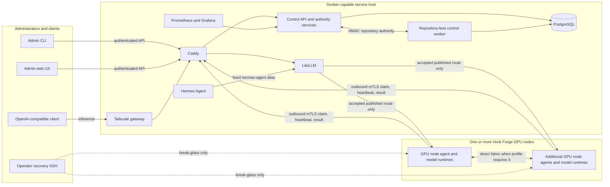

# Vonk Forge architecture overview

Vonk Forge separates the Docker service host from the GPU node compute plane. The
service host can be a NAS or any Docker Compose-capable Linux machine. A cluster
can contain one, two, or more Vonk Forge GPU nodes; no product contract fixes the count or
uses a GPU node hostname or IP address as identity.

Each GPU node is independently installed and enrolled. Its stable `spk_…` identity
comes from the node key and certificate, while its current management address is
fresh authenticated presence evidence. DHCP reservations are useful operationally
but are never control-plane authority. Local DNS is optional: operators may map
`<NAS_MANAGEMENT_IP>` to `<ENROLLMENT_HOSTNAME>`, `<CONTROLLER_HOSTNAME>`, and
`<REGISTRY_HOSTNAME>` in `/etc/hosts` on the NAS and GPU nodes without changing
the trust model.

## Trust and control flow

Vonk Forge has an explicit authority split. PostgreSQL is authoritative for the
local recipe catalog: package families, authored and imported revisions,
WorkloadRun import reports, installations, placements, and runs. A recipe can be
created, imported, resolved, installed, and run while the operator is offline;
the optional global catalog is a source of immutable revisions, never a remote
dependency for local execution. Git/TUF remains authoritative for platform
source, fleet/topology policy, and the existing workload-release projection
until that projection is migrated to catalog revisions.

For the current platform path, the API owns the repository, signed changes,
current deployment-branch head, eligibility policy, model/profile resolution,
and commit-pinned Hermes policy. Accepted plans are canonical and persisted in
PostgreSQL with their commit, targets, operation graph, payload digests, routes,
protocol range, and plan digest. Catalog plans use a recipe revision digest
instead of treating `base_commit` as authorization.

The worker deliberately has no repository mount, Git key, Git/OpenSSH executable,
or GPU node-facing network. It advances durable reconciliations and publishes
atomic, leased route bundles. It obtains current-head and policy decisions from
the API over a dedicated two-party internal network. Those bounded exchanges are
nonce-bound, short-lived, HMAC authenticated, and never exposed by Caddy.

Routine GPU node work is pull-based. Each GPU node agent opens an outbound mTLS request,
claims only operations for its certificate-bound node identity and compatible
protocol/capabilities, heartbeats a fenced attempt, and returns digest-bound
evidence. The control plane does not open SSH, SCP, or an agent connection to a
GPU node. SSH remains available to trusted administrators for initial onboarding,
fabric recovery, and explicit break-glass inspection.

## Service placement

| Component | Responsibility |
| --- | --- |
| Caddy | Tailnet web/API routing, distinct enrollment and agent SNI boundaries, agent mTLS verification, and denial of internal routes. |
| Control API | Admin API/web backend, repository and policy authority, desired-state planning, agent enrollment/claims/results, audit, and metrics. |
| Control worker | Durable reconciliation, dependency waves, compensation, fail-closed withdrawal, and atomic route/LiteLLM publication. |
| PostgreSQL | Jobs, immutable resolved plans, operation/attempt fences, agent identity/presence, reconciliation state, cancellation, and audit evidence. |
| LiteLLM | OpenAI-compatible aliases and quotas generated only from an acknowledged, unexpired publication bundle. |
| Hermes Agent | Persistent tools/UI service that reaches inference only through the fixed repository-policy `hermes-agent` alias. |
| Prometheus/Grafana | Platform, agent, job, route, node-exporter, and DCGM observability. |
| Tailscale | Named remote services without placing remote-access software on GPU nodes. |
| GPU node agent | Non-root outbound control client and the only routine executor of typed node/release/workload operations. |
| GPU node runtimes | Repository-declared model adapters and verified local artifacts; model weights and tensor traffic remain off the service host. |

The Compose project keeps PostgreSQL, agent ingress, repository authority,
registry publication, inference, and Hermes networks separate. Only Caddy
publishes a host port. LiteLLM alone joins GPU node-facing cluster egress; the
worker and API do not.

## Source-first recipe lifecycle

Recipe workloads are built from their own immutable source bundles, not from a
community image registry. A recipe bundle contains one Dockerfile and its
bounded build context; the controller validates the Dockerfile and any Compose
policy, checks fresh builder disk and memory capacity, and queues a typed
`recipe.build.v1` operation. One compatible GPU-node agent performs the
rootless Podman build without a Docker socket, host mounts, devices, secrets, or
privilege, then records the exact OCI image digest and immutable archive
digest. The durable build identity also binds the builder agent's reported
binary SHA-256 and the Docker-archive format. An accepted result therefore
cannot be reused after a builder implementation or export-format change. The
declared archive output bound follows the recipe's temporary build envelope, so
large CUDA-based images are not constrained by a small log-size constant;
diagnostic stdout/stderr remains independently capped.

Rootless Podman ends at the build/export boundary. Accepted workloads run on
DGX Spark's supported Docker Engine and NVIDIA Container Toolkit. The
unprivileged agent never joins the Docker group or opens the daemon socket;
instead, the controller signs an expiring grant bound to one canonical runtime
request, and a root helper compiles only the allow-listed Docker operation.
The helper verifies the imported image, Linux/ARM64 platform, numeric non-root
user, runtime-interface label, resource limits, mounts, ports, and optional
`--gpus all` request. Bridge mode remains the default. A connected multi-node
recipe may select one compiled direct-fabric shape with host networking, host
IPC, `/dev/infiniband`, and fixed memlock/stack limits; the helper requires the
complete shape plus the host-firewall preflight. It rejects every partial or
additional host privilege, arbitrary devices, privileged containers,
additional capabilities, and socket mounts.

Public build networking is fail-closed until a hostname-aware egress
proxy/firewall is installed. `slirp4netns` is not an allowlist, so the agent
rejects `network.mode: public` rather than allowing a Dockerfile to reach
private or metadata endpoints. Networkless recipes and cached pinned bases are
the supported initial build path.

Installation maps a resolved recipe profile to exact node identities and ranks.
The controller transfers that one verified Docker-loadable archive over the
authenticated agent channel and each target re-verifies it before import, so a
three-node profile never rebuilds independently on the other two nodes. Model
weights and other declared artifacts are installed separately, with disk checks before
installation and memory/VRAM, active-workload, and direct-fabric checks before
start. Multi-node v1 uses ordinary TCP over the declared direct-fabric
addresses; it does not claim GPUDirect RDMA support. The resulting workload
route is published to LiteLLM only after every
mapped node has acknowledged the same build and run evidence. The global
catalog, when enabled, stores recipe metadata and source bundles; it does not
store image layers or registry credentials.

## External release and future global services

The local control plane is complete without any hosted global service. This
repository's GitHub Actions release workflow builds, tests, signs, and publishes
one versioned platform set: the control images, signed platform manifest, and
matching ARM64 `vonk-forge-agent` Debian package. The optional apt publication
consumes that exact package at `packages.vonkforge.ai`; it is not a Railway job.

The separate `vonk-forge-web` repository is a future global catalog surface. Its
frontend is intended for Cloudflare Pages. Only when the global catalog is
needed should its API, validation worker, and PostgreSQL database be provisioned
on Railway. That hosted catalog publishes immutable metadata for import; it does
not run recipe containers or store model weights. Local PostgreSQL remains
authoritative for installation, placement, admission, and execution.

## Reconciliation and route publication

For a new repository commit or profile, the control plane follows a durable,
restart-safe sequence:

1. Verify the commit is current and eligible, resolve the complete profile, and
   persist the immutable plan before mutation.
2. Withdraw the prior route into acknowledged maintenance.
3. Execute stop operations in repository-declared order, then prove every
   affected node has zero active NVIDIA compute processes.
4. Install, prepare, start, health-check, and verify the new workload graph
   through outbound agent operations.
5. Compensate or enter `waiting-for-operator` when mutation outcome is uncertain.
6. Publish routes only after every required result and endpoint-evidence digest
   is accepted, then require an exact LiteLLM supervisor acknowledgement.
7. Renew only while the applicable authority (catalog revision or Git/TUF
   release), agent compatibility, certificate state, authenticated presence,
   and publication lease remain valid. Otherwise withdraw fail closed.

Route generations are staged under immutable digest-named directories and become
active through one atomic marker. LiteLLM mounts the publication volume read-only
and falls back to an empty bootstrap on malformed, unacknowledged, restored,
expired, or withdrawn state.

## Scaling and networking

Adding a GPU node repeats the same install/enroll operation and adds a stable node
record to the repository fleet definition. Placement and operation ordering are
deterministic for one, two, sixteen, or more nodes; sixteen is a tested small-
cluster shape, not a hard product limit.

Tensor-parallel traffic follows the repository topology directly between the
selected GPU nodes. It never traverses Caddy, LiteLLM, PostgreSQL, or the service
host. The [fleet migration runbook](runbooks/fleet-migration.md) covers stable
identity and count-independent inventory. Model/profile contracts and capacity
comparisons live in the [model/profile overview](model-profile-overview.md) and
[model capacity overview](model-capacity-overview.md).
